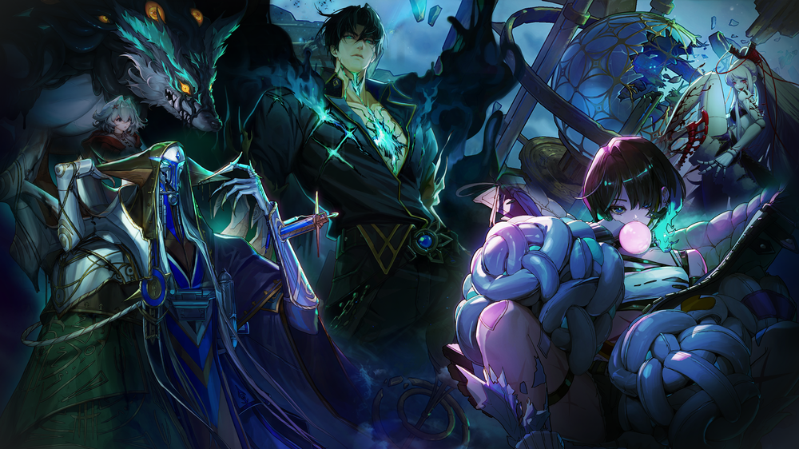
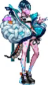
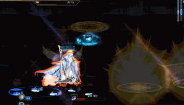
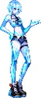
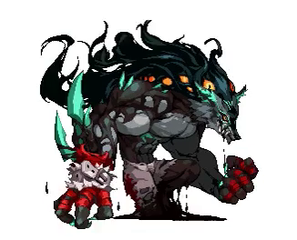
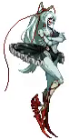
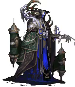
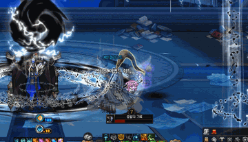
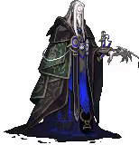
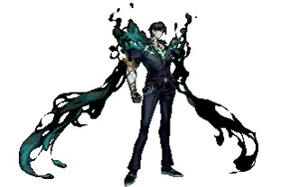

# Apocalypse

*Legion Dungeon Guide*

*Author: Zein (reach out to Zein on Discord for feedback)*

**AI Disclosure:**

I used AI to help me write this guide. Specific use cases were translating Korean guide videos using YouTube's AI Auto-dub feature, translating Namu pages, translating Korean forum pages, format/style this guide, and extract clips from videos I credited to help display mechanics or patterns. I understand some people have reservations against AI usage in content, so I wanted to be transparent.

## Content Overview

- **Entry:** Level 115. 73,993 Fame. Rewards are shared with Venus, so only one Legion counts per week.
- **Difficulty Notes:** Matching and C1 stop after Bliss. C3 "Desperate Suppression" (a future patch) alters Ica and Lopez.
- **Legion Mechanic:** You get the option to pick between Skirmisher (a counter ability that is indicated by a mark) or Guardian (a shield for you and nearby allies) at the start. Solo locks you to Skirmisher.
- **Multipliers:** Base Damage multiplier starts at 75% on your first entry outside Matching, then climbs as you land pattern breaks and counters, resetting each phase change (100% for most bosses, 75% for Socors). Killing Fictum or Bliss adds +10% damage in C2 (+5% in C3). Killing Socors adds +5% in C3.
- **Timers:** Ica/Fictum/Bliss: 5 min. Socors/Lopez: 10 min. Can't kill Ica in time? You likely can't clear what comes after her either.
- No operator voice guide this time: read patterns visually.
- **Skip route:** Beat Ica within 1 minute to skip straight to Socors (skipping Fictum and Bliss); within 2 minutes to skip to Bliss (skipping just Fictum). This route never skips Socors himself. In C3, killing Ica within 1 minute opens a separate route straight to Lopez instead.
- **Seasonal Gimmick:** Overpower is a gimmick that will be the gate for some groggies in this Legion alongside prior Advanced Dungeons. If a diamond shape appears on the boss with a number in it, you and your party must cast that many skills tagged with Overpower (they will glow red on your hotbar) to beat the gimmick.

## 1. Ica

tl;dr: Jump over to red lines and place the bombs away from safe zones. P2 is gauge management: cross heat lines or freeze.

| Tier | Solo | Party |
| --- | --- | --- |
| C2 | ~572M | 201B |
| C3 | 1.15B | ~435B |

**Neutralization Gauge:** 66% of HP (Matching/C1) → 100% of HP (C2+)

### Phase 1

- **Entry Grenade:** On entry, a bomb appears; use Skirmish to knock it toward Ica.
  <video src="images/ice-grenade.mp4" autoplay loop muted playsinline title="Entry Grenade"></video>

- **Tripwires:** Blue lines turn red; walking through deals major damage and a wide splash damage. Jump over red lines to avoid this.
  <video src="images/ica-ice-mine.mp4" autoplay loop muted playsinline title="Ice Lines"></video>

- **Cold Bullet**: Map-wide attack where the safe spot is a small circle directly at Ica's location.
  <video src="images/cold-bullet.mp4" autoplay loop muted playsinline title="Cold Bullet"></video>

- **Time Bomb:** This pattern starts with a few bombs that track the player. These bombs explode into a blue frozen ground that will also eventually explode. The initial location of the bomb is the safe zone. Avoid these explosions, any red aoes, red tripwires, and Cold Bullet during this pattern. Finishes with a set of glowing orbs: basic-attack the one flashing red to successfully complete the pattern.
  <video src="images/ica-time-bomb.mp4" autoplay loop muted playsinline title="Time Bomb"></video>

- **Condensed Bomb**: Watch her footprints to figure out where Ica walked, face the direction she walked and use Skirmish on the grenade to knock it towards Ica.
  

### Phase 2

- **Ice Gauge:** Everyone has a personal gauge that fills from getting hit by the blue zone or its attacks. Cross the line through the map's center to lower your gauge.
- **Cold Release:** When this cast comes up, use Skirmish toward the boss to counter it.
  <video src="images/cold-release.mp4" autoplay loop muted playsinline title="Cold Release"></video>

- **Small Bullets:** Ice launches small bullets towards the opposite side of the map. Stay on the same side of Ica to avoid the damage from these, they will explode on contact with the heat line and do damage in the direction they were moving.
  <video src="images/small-bullets.mp4" autoplay loop muted playsinline title="Small Bullets"></video>
	
- **Absolute Zero (groggy):** Watch the direction of the falling orb and move to the alternating opposite side (getting hit by one fills half the gauge). Lure the resulting red floor zone to the map edge and sprint to the opposite side, repeat twice, then dodge the center attack and close in for the groggy. Gauge fills fast during this cast. Cross the line quickly and repeatedly while doing this pattern.
    <video src="images/neutralize-break.mp4" autoplay loop muted playsinline title="Neutralize Break"></video>

- **Blizzard:** After the orbs end, a cold storm wanders the map. It deals no damage but raises the Ice Gauge on contact, cross the line proactively rather than waiting for the gauge to fill. The storm converges on the center and force-freezes everyone: basic attack when the cast bar hits the green zone, then move next to Ica to dodge her finisher. Ica is groggied upon success.
  <video src="images/cold-storm-qte.mp4" autoplay loop muted playsinline title="Cold Storm QTE"></video>

- If your party has a Glacial Master, they skip the freeze-break timing entirely and can trigger the groggy immediately.

### C3

- **End of the Party:** On entry, C3 opens with this sequence: Entry grenade you need to use Skirmish on to throw toward Ica. A yellow orb appears with a zone, stay inside it, the gauge only fills while you're outside it, and if it fills completely you're expelled from the dungeon. Dodge her attacks while staying in the zone the best you can, but you will have to step outside briefly to dodge some patterns. Finally, dodge the center attack, then pass the Skirmish check to raise a barrier around the yellow orb and step inside it.
    <video src="images/ica-end-of-party.mp4" autoplay loop muted playsinline title="End of the Party"></video>

## 2. Fictum

tl;dr: Jump on things, Skirmish when you can.

| Tier | Solo | Party |
| --- | --- | --- |
| C1 | 180M | 69.4B |
| C2 | 452M | 158.1B |
| C3 | 592M | 224B |

**Neutralization Gauge:** 66% of HP

- **Dive:** A jump-marker floor zone appears on entry (and recurs through the fight); jump inside it then Skirmish when the marker appears afterwards. His name tag position may reveal the location of Dive early.
  <video src="images/fictum-dive.mp4" autoplay loop muted playsinline title="Fictum dive"></video>

- **Deception:** A girl approaches from one side, a red aoe following her, bump into her to stop her movement and maintain your safe zone.
  <video src="images/fictum-deception.mp4" autoplay loop muted playsinline title="Fictum deception"></video>

- **Chasing Shadows (groggy):** A small safe zone spawns and closes in. The girl will eventually appear, jump to the girl to open a new safe zone, then jump back to Fictum, repeating the cycle. A yellow orb eventually appears: grab it and bump it into Fictum. Repeat until the gimmick counter reaches 0. 
  <video src="images/fictum-chasing-shadows.mp4" autoplay loop muted playsinline title="Fictum chasing shadows"></video>

- **Shards of the Shadows (groggy):** Spikes will rain around the arena, with one glowing green. A red droppable aoe will spawn under you, drop it over the glowing spike. Afterwards the spike will launch again and charge a screen-wide aoe. The spike itself will have a safe zone directly on where it landed. Run to it. Use Skirmish on Fictum. He will repeat this exact sequence once. After two successful skirmishes, Fictum will then spawn 4 more spikes and punch them up. One by one, they will fall and repeat the screen-wide aoe with small safe zone pattern. After the final skirmish check, you will have an overpower check before finally reaching groggy. 
  <video src="images/fictum-shards-of-the-shadows.mp4" autoplay loop muted playsinline title="Fictum shards of the shadows"></video>

## 3. Bliss

tl;dr: Dodge into a shadow for Backstage, lure the light onto the unlit clones for Spotlight, then Skirmish.

| Tier | Solo | Party |
| --- | --- | --- |
| C1 | 198M | 66.7B |
| C2 | 497M | 174B |
| C3 | 652M | 246B |

**Neutralization Gauge:** 66% of HP

- **Spotlight:** Beams sweep the arena and land on Bliss's clones. Find the one clone with no spotlight on it and lure the beam onto her, then Skirmish. You will need to do this for her core patterns.
  <video src="images/bliss-spotlight.mp4" autoplay loop muted playsinline title="Bliss spotlight"></video>

- **Backstage:** Clones spawn a shadow safe zone behind them that blocks the attack. Stay in the shadow to avoid it.
  <video src="images/bliss-backstage.mp4" autoplay loop muted playsinline title="Bliss backstage"></video>

- **Dance of Death (groggy):** She opens with a large red aoe and a small safe zone at center. Afterwards, she spawns a white safe zone. Stay inside this zone while dodging red aoes and her spinning clones. Partway through, she jumps to the center of the white safezone, you must jump to avoid the damage from this attack. She then casts Backstage and Spotlight together. Stay in the backstage safe zone, then drag Spotlight onto the unlit clone. Finally, this will trigger a Skirmish opportunity for the groggy.
  <video src="images/dance-of-death.mp4" autoplay loop muted playsinline title="Dance of Death"></video>

- **Quiet Play (groggy):** She opens with a screen wide red aoe. Stand in the glowing safe bubble (which is also a green aoe) to avoid it. Then an escalating 3-wave Backstage+Spotlight sequence: wave 1 is a single spotlight followed by backstage, wave 2 doubles to two simultaneous spotlights followed by backstage, and wave 3 starts with a single spotlight into backstage, before finishing with three simultaneous spotlights and a final backstage after the last spotlight. Each wave ends with an opportunity to Skirmish.
  
<video src="images/quiet-play-wave2.mp4" autoplay loop muted playsinline title="Quiet Play wave 2"></video><video src="images/quiet-play-wave3.mp4" autoplay loop muted playsinline title="Quiet Play wave 3"></video>

  - **1 or more successes out of 3 →** finale’s Overpower requirement drops by success count (solo: 3/2/1, party: 12/8/4) and the red AoE shrinks.
  - **0/3 successes →** Overpower requirement locks at 99 (unbreakable), death attack covers the whole map. Pop invuln or die.

## 4. Socors

tl;dr: Grab Constellation → Bump creature.

| Tier | Solo | Party |
| --- | --- | --- |
| C2 | ~634M | 222B |
| C3 | 582M | ~275B |

**Neutralization Gauge:** 118% of HP

### Phase 1

- **Normal Attack:** Socors creates a ring of creatures around himself. Use Skirmish on the first one to create a black constellation on the floor you need to pick up. After picking it up, bump into the next creature in the ring. Repeat until the pattern completes. Each successful bump also drops a yellow orb. Grab it and basic attack him to fire it, chipping his Neutralization gauge.
  <video src="images/socors-normal.mp4" autoplay loop muted playsinline title="Socors normal attack"></video>

- **Wave of Reversal:** Socors targets a player with an attack. Lure the attack to a nearby creature and hide completely behind it to avoid the attack. Afterwards a constellation will spawn, pick it up, and bump the black sphere somewhere on the screen to reduce the gimmick counter. Also, bumping will drop a yellow orb. Pick up the orb and bump Socors if you want to reduce his Neutralization gauge.
  <video src="images/wave-of-reversal.mp4" autoplay loop muted playsinline title="Wave of Reversal"></video>

- **Record of the End:** Eat the sigil, then bump into Socors to reduce the pattern counter shown on screen; repeat until it hits 0 for the groggy.
  

### Phase 2

- **Start of Phase 2:** Socors opens with a shield. Grab a constellation, bump a nearby creature for a yellow orb, then walk up and basic-attack him to remove the shield.
  <video src="images/socors-p2-shield.mp4" autoplay loop muted playsinline title="Start of Phase 2"></video>

- **Fading Harmony:** The usual, grab a constellation and then bump a creature, except this time the creatures need two bumps. When you do this twice to the same creature, you reduce the gimmick counter by 1 and the creature drops a yellow orb.
  <video src="images/fading-harmony.mp4" autoplay loop muted playsinline title="Fading Harmony"></video>

- **Sea of the End:** A rotating black floor hazard is up throughout this pattern. You can jump over it. Same loop though, grab a constellation, bump a creature, but this time you have to pick up the creature's orb and basic attack Socors with it to reduce the gimmick counter.
  <video src="images/sea-of-the-end.mp4" autoplay loop muted playsinline title="Sea of the End"></video>

## 5. Lopez

tl;dr: P1 Jumping and basic-attacking over a white tile spawns a shield. P2-P3 replaces that shield with an attack interruption. Avoid lasers. Avoid rings. C3 is replaying the entire fight.

### C2

| Tier | Phase | Solo | Party |
| --- | --- | --- | --- |
| C2 | P1 | 314M | 110.0B |
| C2 | P2/3 (shared pool) | 1.04B | 362.9B |
| C3 | P1 | ? | ? |
| C3 | P2/3 | ? | ? |

**Neutralization Gauge:** 160% of HP

**White tile: jump + basic attack on a white tile = shield that blocks Lopez’s next hit. If a white tile appears, that attack is otherwise undodgeable.**

<video src="images/white-tile.mp4" autoplay loop muted playsinline title="White tile"></video>

#### Phase 1 (both patterns must be broken once, groggy needs both)

- **Destruction:** A ring appears: Red means the ring will attack everything outside it, so to avoid it you must step inside it. Green means the ring will attack everything inside it step outside. Can have multiple rings or full-map versions. You can use a white tile shield to avoid a full map ring .
  <video src="images/destruction-c2.mp4" autoplay loop muted playsinline title="Destruction"></video>

- **End Pillar:** A laser chases a player continuously. The further you are, the faster it will chase you. While you dodge a combination of Destruction casts and red tiles. A white tile appears during this, but do NOT use it early. The laser can destroy the shield. The laser stops moving briefly before the cast bar finishes, create the white tile barrier after it stops moving.
  <video src="images/end-pillar.mp4" autoplay loop muted playsinline title="End Pillar"></video>

- **End Domain:** Follow the lit flame tile. When it goes out, move to the next one. Repeat this until you can create a white tile barrier. After the first white tile barrier he throws some red tile patterns at you. Dodge these until a white tile appears again. Activating that white tile finishes the pattern.
  <video src="images/end-domain.mp4" autoplay loop muted playsinline title="End Domain"></video>

#### Phase 2

- **Annihilation Strike:** In P2, the white tile no longer raises a shield, instead jump + basic attack on it cancels the Annihilation Strike attack. Time it to when Lopez is actually on screen. He has a habit of disappearing during some attacks. If you use the white tile while he is gone you will fail to interrupt the attack and get punished.
- **Marker color matters**: Pay attention to Skirmish markers during this phase. If they are yellow, Skirmish as usual. If they are red, it is a bait. Skirmishing on a red marker leads to death (but a cool animation at least).
  
<video src="images/yellow-marker.mp4" autoplay loop muted playsinline title="Yellow marker"></video><video src="images/red-marker.mp4" autoplay loop muted playsinline title="Red marker"></video><video src="images/red-marker-failure.mp4" autoplay loop muted playsinline title="Red marker failure"></video>

- **The Coming End:** Lopez introduces lasers with expanding red aoes for this pattern. It boils down to dodging red AoEs, red tiles, and expanding lasers throughout, using Skirmish, and canceling Annihilation Strike with the white tile whenever it comes up. The sequence is fixed after the opening, so you can memorize this over time. 
  
<video src="images/attack-type1.mp4" autoplay loop muted playsinline title="Attack Type 1"></video><video src="images/attack-type2.mp4" autoplay loop muted playsinline title="Attack Type 2"></video><video src="images/ce-variants.mp4" autoplay loop muted playsinline title="Coming End variants"></video><video src="images/impending-doom.mp4" autoplay loop muted playsinline title="Impending Doom repositioning"></video><video src="images/coming-end.mp4" autoplay loop muted playsinline title="The Coming End"></video>

  - After the marker rounds, a green warning-sign attack appears; the tiles it covers turn green and stay bad, so lure it as far to the map edge as possible to minimize how much of the arena you lose.
    <video src="images/green-tile.mp4" autoplay loop muted playsinline title="Green tiles"></video>

#### Phase 3 (enrage: triggers off Coming End ending, or Neutralization fully drained)

Turns red, damage taken locked at 225%, Neutralization locked. Same P2 patterns from earlier.

- **Doom gauge:** Fills under his HP bar over a fixed 100 seconds; if it fills, he casts "The End" at +325% damage taken and ejects the party from the dungeon whenever he completes "The End".
  <video src="images/doom-gauge.mp4" autoplay loop muted playsinline title="Doom gauge"></video>

### C3

Revive windows are party-only (solo gets none, and any wipe restarts from P1).

#### Phase 1 (base 75%)

- **End Pillar:** Upon entry, you will need to immediately interact with a white tile to spawn a barrier. Afterwards, it's the same laser concept from C2, avoid it while juggling other patterns. The End Domain pattern will overlap here, surrounded by red tiles. When the laser stops moving, interact with the white tile. Afterwards 4 lasers close in while rotating counter-clockwise. Dodge the lasers and two slash attacks Lopez casts towards the center of the screen. Finally, activate the white tile and use Skirmish for the groggy. After Groggy or upon reaching 0% HP, you move to P2-1.
  <video src="images/p1-groggy.mp4" autoplay loop muted playsinline title="End Pillar C3 groggy"></video>

#### Phase 2-1 (base 75%, up to 175% via Overwhelm)

- This phase is really just dodging based off what you've learned to get here.

- Overwhelm: Permanent damage-taken buff based on how much HP you chip off each phase, carries over and stacks as you progress
- **Scarring:** Expelled from the fight after 3 hits. Using Skirmish successfully during a pattern clears your stacks.
- **Flame of Ruin:** Tracking laser + tiles turning green sequentially in a counter-clockwise direction, starting at 12 o’clock. The final safe tile will be the center one. If the laser is too close, you can jump over the green tiles safely (without landing) and skirmish from that position. It is suggested that you move the laser to the right as much as you can to make returning to the center easy.
  <video src="images/flame-of-ruin.mp4" autoplay loop muted playsinline title="Flame of Ruin"></video>

- **Destruction and the End:** Fixed sequence.
  - Tiles turn red around Lopez, you must move towards regular tiles to avoid being hit. Repeat until there is 1 left. He then shoots a red aoe alongside two screen slashes. Avoid all of them from the safe tile you're standing on. He then slams the ground, dodge that too. He will turn the floor red again while jumping onto a tile that will become a safe zone. He jumps away and casts a large red aoe. Stay in your tile until the tile he is standing on becomes a new safe zone and jump to it to avoid the aoe. This pattern continues with a variety of differences, but the concept is the same as the prior two explanations. 
    <video src="images/lopez-destruction-sequence-1.mp4" autoplay loop muted playsinline title="Destruction and the End: sequence 1"></video><video src="images/lopez-destruction-sequence-2.mp4" autoplay loop muted playsinline title="Destruction and the End: sequence 2"></video><video src="images/lopez-destruction-finale-collapse.mp4" autoplay loop muted playsinline title="Destruction and the End: finale collapse"></video>

#### Phase 2-2 (descent: 4 fixed segments, reskins of the mid-bosses)

- **Archive segment (Socors’ floor):** A yellow orb will spawn near Lopez during Annihilation. Grab it for a shield. Floor tilts, dodge the debris that slides. One piece of rubble will fall with jump prompt. It will create a safe zone on one side. Stand in the safe zone to avoid his attacks and finally repeat the yellow orb shield to block Annihilation.
  <video src="images/archive.mp4" autoplay loop muted playsinline title="Archive segment"></video>

- **Selection segment (Bliss’ floor):** Dodge the reds, place the spotlight on Lopez’s real body to cancel his attack. 3 rocks eventually appear and they each provide a safe zone: use them to block his next three attacks. On the 3rd, you must also jump, since it overlaps a ground slam. Finally, place the spotlight on Lopez from there.
  
<video src="images/selection-spotlight.mp4" autoplay loop muted playsinline title="Selection spotlight"></video><video src="images/selection.mp4" autoplay loop muted playsinline title="Selection segment"></video>

- **Coordination segment (Fictum's floor):** Dark-red jump pad: jump right as it finishes filling, then jump onto Lopez himself to cancel his attack. Eventually you'll have to chain 4x jump pads in a row.
  <video src="images/coordination.mp4" autoplay loop muted playsinline title="Coordination segment"></video>

- **Mist segment (Ica’s floor):** The Doom gauge here works like Ica’s heat gauge: cross the line to lower it. As usual, dodge everything. At some point Lopez will forcibly knock you down. Hold Quick Rebound's iframe to survive the 4 expanding lasers that will fill the screen. Beat the overpower skill check afterwards for groggy.
  <video src="images/quick-rebound.mp4" autoplay loop muted playsinline title="Mist laser"></video>

#### Phase 3 (no base multiplier: runs entirely on Overwhelm, cap 200%)

- **Arena:** You can fall off of the arena in this phase. Take care running around as it gets smaller. Note you may jump over the edge of the arena and return if you need extra space to dodge.

- **Gaze into the Abyss:** Orb telegraphed in front of him; move behind him and face him with your shield up, it turns white when you're in the right spot.
  <video src="images/gaze-into-abyss.mp4" autoplay loop muted playsinline title="Gaze into the Abyss"></video>

  - Standing too far near the edge can knock you out of the arena, and even a successful cancel knocks you back, so don't sit right on the boundary.
    <video src="images/arena-knockback.mp4" autoplay loop muted playsinline title="Arena knockback risk"></video>

- His other common patterns here mostly reuse what you've already learned from the earlier phases, tied together with the Gaze into the Abyss shield, so there's no real need to break each one down individually.
- **The Advent of the End:** Eventually Lopez goes invulnerable and appears behind the Arena. He throws a meteor towards the center of the arena without hit indicators (no red aoes). Meteors then fly in repeatedly. You must manage avoiding the regular attacks and the meteors as they're being thrown at you. Eventually, Lopez returns to the arena and begins to drop meteors on top of it. He shrinks the arena as this happens. You must pick up the beads that appear around the red aoe of the meteor to expand it back out enough to find a safe zone. Repeat until a crack appears in the Arena. Step into the cracked floor that appears for the groggy.
  <video src="images/advent-full.mp4" autoplay loop muted playsinline title="Advent of the End full sequence"></video>

## Sources

- [Namu Wiki: Apocalypse overview](https://namu.wiki/w/%EC%95%84%ED%8F%AC%EC%B9%BC%EB%A6%BD%EC%8A%A4%20:%20%EC%95%88%ED%8B%B0%EC%97%94%EB%B0%94%EC%9D%B4)
- [Namu Wiki: Apocalypse monster page](https://namu.wiki/w/%EC%95%84%ED%8F%AC%EC%B9%BC%EB%A6%BD%EC%8A%A4%20:%20%EC%95%88%ED%8B%B0%EC%97%94%EB%B0%94%EC%9D%B4/%EB%AA%AC%EC%8A%A4%ED%84%B0)
- [DF Nexon community pattern breakdown](https://df.nexon.com/community/dnfboard/article/2980891)
- [DF Nexon C3 pattern thread](https://df.nexon.com/community/dnfboard/article/2983764)
- [DCInside DFIP: C3 change notes](https://m.dcinside.com/board/dfip/5125054)
- [YouTube guide](https://www.youtube.com/watch?v=pXLezAjEkZU)
- [YouTube guide (C3 focus)](https://www.youtube.com/watch?v=APHchLSAH2o)
- [YouTube guide (comprehensive)](https://www.youtube.com/watch?v=fiojBTDTvxQ)
- [DCInside DFIP forum: C3 pattern tips](https://m.dcinside.com/board/dfip/5096970)